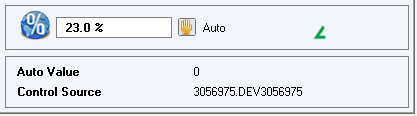
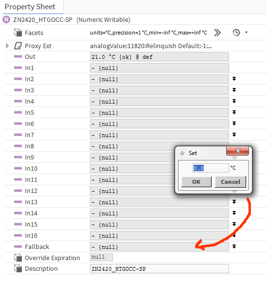
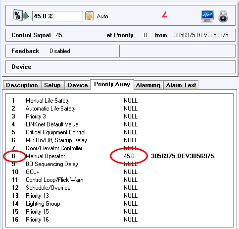
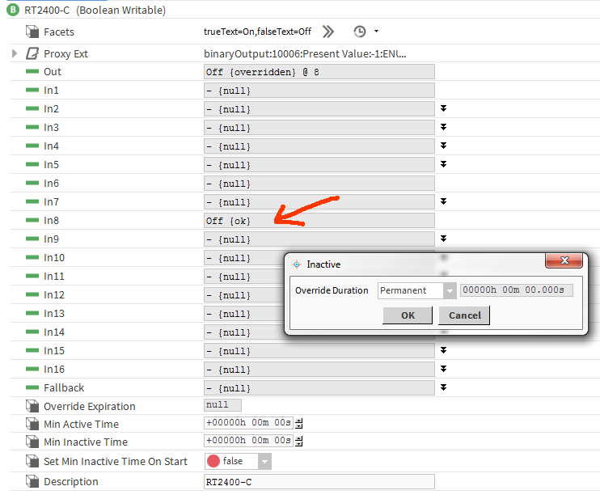
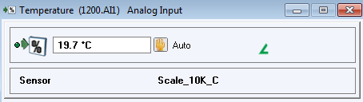
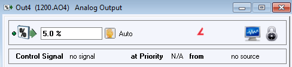
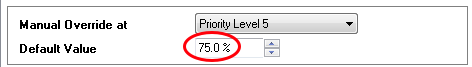

How to define a device and interact with points
===================================================
Define a controller
----------------------------------------

Once the bacnet variable is created, you can define devices.
    
Example::

    import BAC0
    bacnet = BAC0.connect()
    # or specify the IP you want to use / bacnet = BAC0.connect(ip='192.168.1.10/24')
    # by default, it will attempt an internet connection and use the network adapter
    # connected to the internet.
    # Specifying the network mask will allow the usage of a local broadcast address
    # like 192.168.1.255 instead of the global broadcast address 255.255.255.255
    # which could be blocked in some cases.
    # You can also use :
    # bacnet = BAC0.lite() to force the script to load only minimum features.
    # Please note that if Bokeh, Pandas or Flask are not installed, using connect() will in fact call the lite version.

    # Get the list of devices seen on the network
    bacnet.devices

    # Define a controller (this one is on MSTP #3, MAC addr 4, device ID 5504)    
    mycontroller = BAC0.device('3:4', 5504, bacnet)
    
    # Get the list of "registered" devices 
    bacnet.registered_devices
    

Some caveats
*************

Segmentation
.............

Some devices do not support segmentation. BAC0 will try to detect that and will
not allow "read property multiple" to be used. But it is sometimes better to 
speciy to BAC0 that the device doesn't support segmentation.

To do so, use the parameter::

    my_old_device = BAC0.connect('3:4', 5504, bacnet, segmentation_supported=False)
    
Object List
............

By default, BAC0 will read the object list from the controller and define every
points found inside the device as points. This behaviour may not be optimal in
all use cases. BAC0 allows you to provide a custom object list when creating the
device.

To do so, use this syntax::    

    # Define your own list
    my_obj_list = [('file', 1),
                 ('analogInput', 2),
                 ('analogInput', 3),
                 ('analogInput', 5),
                 ('analogInput', 4),
                 ('analogInput', 0),
                 ('analogInput', 1)]
    
    # Provide it as an argument               
    fx = BAC0.device('2:5',5,bacnet, object_list = my_obj_list)

Look for points in controller
-----------------------------

Example::

    mycontroller.points

Read the value of a point
--------------------------
To read a point, simply ask for it using bracket syntax::

    mycontroller['point_name']

Writing to Points
-----------------

Simple write
************
If point is a value:

    * analogValue (AV)
    * binaryValue (BV)
    * multistateValue (MV) 
    
You can change its value with a simple assignment.  BAC0 will write the value to the object's 
**presentValue** at the default priority.::

    mycontroller['point_name'] = 23 

    
    *Example from Delta Controls OWS Workstation*
    

    
    *Example from Niagara 4 station*

Write to an Output (Override)
*****************************
If the point is an output:

    * analogOutput (AO) 
    * binaryOutput (BO) 
    * multistateOutput (MO)

You can change its value with a simple assignment.  BAC0 will write the value to the object's 
**presentValue** (a.k.a override it) at priority 8 (Manual Operator).::

    mycontroller['outputName'] = 45

    
    *Example from Delta Controls OWS Workstation*
    

    
    *Example from Niagara 4 station*

Write to an Input (simulate)
****************************
If the point is an input:

    * analogInput (AI) 
    * binaryOutput (BO) 
    * multistateOutput (MO) 

You can change its value with a simple assigment, thus overriding any external value it is 
reading and simulating a different sensor reading.  The override occurs because  
BAC0 sets the point's **out_of_service** (On) and then writes to the point's **presentValue**.
 
    mycontroller['inputName'] = <simulated value>

    mycontroller['Temperature'] = 23.5      # overiding actual reading of 18.8 C

.. figure:: images/AI_override.png
    :width: 400px
    :align: center
    :alt: Example from Delta Controls OWS Workstation
    :figclass: align-center
    
    *Example from Delta Controls OWS Workstation*

In a Niagara station, you would need to create a new point using the "out_of_service" 
property, then set this point to True. Then you would need to create 
(if not already done) a point writable to the present value property and write
to it. No screenshot available.

Releasing an Input simulation or Output override
*************************************************

To return control of an Input or Output back to the controller, it needs to be released.
Releasing a point returns it automatic control.  This is done with an assignment to 'auto'.::

    mycontroller['pointToRelease'] = 'auto'

    
    *Example from Delta Controls OWS Workstation*
    

    
    *Example from Delta Controls OWS Workstation*

In a Niagara station, you would need to create a new point using the "out_of_service" 
property, then set this point to False. No screenshot available.
    
Setting a Relinquish_Default
****************************
When a point (with a priority array) is released of all override commands, it takes on the value 
of its **Relinquish_Default**. [BACnet clause 12.4.12]  If you wish to set this default value, 
you may with this command::

    mycontroller['pointToChange'].default(<value>)
    mycontroller['Output'].default(75)

    
    *Example from Delta Controls OWS Workstation*
    
.. figure:: images/niagara_relinquish_default.png
    :width: 400px
    :align: center
    :alt: Example from Niagara 4 station
    :figclass: align-center
    
    *Example from Niagara 4 station*

BACnet properties
*******************
BAC0 defines its own "image" of a controller. All points inside a `BAC0.device` are Python 
objects with which we can interact. If you want to access native BACnet objects and properties
there are functions you can use.

Read all device properties
===========================
You can retrieve the list of device properties using::

    device.bacnet_properties
    # will return a cached version by default. If things have changed, you can refresh using.
    device.update_bacnet_properties()

Often, in this list, you will see proprietary properties added by the manufacturer. They can be 
recognize by their name, an integer.

Read Property
==============
You can read simple properties using ::
    
    prop = ('device',100,'objectName')
    device.read_property(prop)
    # this will return the object name 
    prop = ('analogInput',1,'priorityArray')
    device.read_property(prop)
    # this will return the priority array of AI1 

Write to property
==================
You can write to a property using ::

    prop = ('analogValue',1,'presentValue')
    bacnet.write_property(prop,value=98,priority=7)
