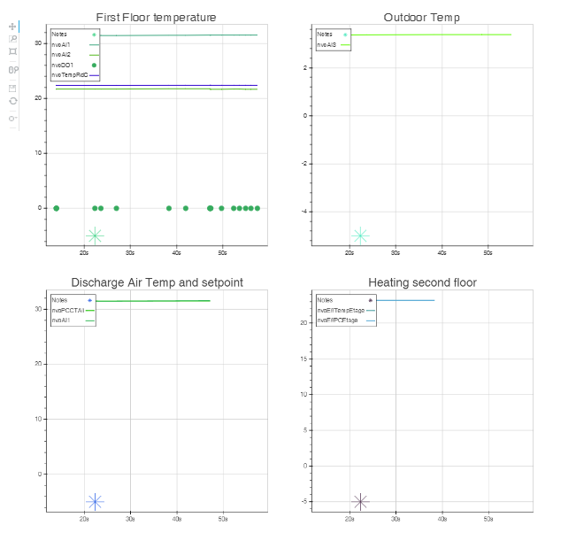
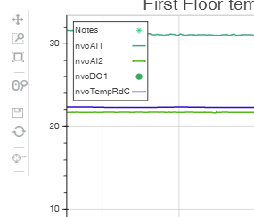
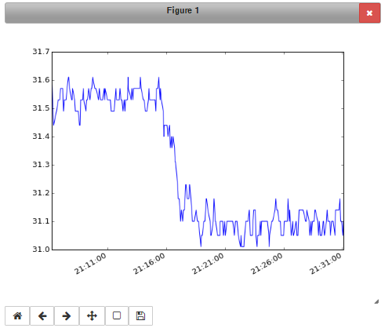

Trends
======
Trending is a nice feature when you want to see how a points value changed over time.
This is only possible using matplotlib directly in Jupyter_.
And also in the Web Interface using Bokeh_ [http://bokeh.pydata.org/en/latest/] which brings 
a complete set of wonderful features for visualizing point histories (a.k.a. trends). 
The best feature of all - the ability to see Live Trends of your data as it occurs.

Matplotlib
----------
Matplotlib_ is a well known data plotting library for Python. As BAC0's historical point data 
are pandas Series and DataFrames, it's possible to use Matplotlib with BAC0.
i.e. Showing a chart using matplotlib::

    %matplotlib notebook
    # or matplotlib inline for a basic interface
    controller['nvoAI1'].history.plot()

|matplotlib|

Seaborn
-------
Seaborn_ is a library built over Matplotlib_ that extends the possibilities of creating statistical
trends of your data. I strongly suggest you have a look to this library.

Bokeh
-----
Bokeh is a Python interactive visualization library targeting modern web browsers for presentation. 
Its goal is to provide elegant, concise graphics, with high-performance interactivity over very large 
or streaming datasets. Bokeh can help anyone who would like to quickly create interactive plots, dashboards, 
and data applications.

.. note::
    BAC0 trending features use Bokeh when running in "complete" mode. This requires the user to have some
    libraries installed :

      * bokeh
      * flask
      * flask-bootstrap
      * pandas
      * numpy

.. note::
   Running in "complete" mode may be hard to accomplish if you are running BAC0 on a Raspberry Pi.
   If doing so, I strongly recommend using the package berryconda_ which will install everything
   you need on the RPi to use Pandas, numpy... already compiled for the RPi.

   A simple call for "conda install bokeh" will install the package.

A web interface
---------------
To simplify the usage of the live trending feature, BAC0 implements a Web Server (running with Flask).
Connect to http://localhost:8111 and you will get access to a Dashboard and the Trends page.

Internally, BAC0 will run two servers (flask and a bokeh server) that will handle the connection to the
web interface and provide the web page with a live trend of the charts that have been sent to the interface.

Add/Remove plots to Bokeh
---------------------------
At first, the web page will be empty and no trend will appear. The user needs to specify which points must
be trended. Points to trend are added to a list monitored by the "network" object. This will allow 
to add trends coming from multiple controllers easily ::

    #each point can be added 
    controller['nvoAI1'].chart()
    
    #or we can add them using the "network" object
    bacnet.add_chart(controller['nvoAI1'])

    # TrendLog object can also be added
    trendlog_object.chart()
    
The list of trended points can be retrieve ::

    bacnet.trends
    #will give a list of all points added    

To remove points ::

    #on the point directly
    controller['nvoAI1'].chart(remove=True)
    bacnet.remove_chart(controller['nvoAI1'])

|bokeh_plots|

Bokeh Features
--------------
Bokeh has an extensive set of features. Exploring them is beyond the scope of this documentation.
Instead you may discover them yourself at [http://www.bokehplots.com].
A couple of its features are highlighted below.

Hover tool:

|bokeh_hover|

And a lot of other options like pan, box zoom, mouse wheel zoom, save, etc...:

|bokeh_tools|

By default, x-axis will be a timeseries and will be linked between trends. So if you span one, 
or zoom one, the other plots will follow, giving you the eaxct same x-axis for every plots.

Bokeh Demo
----------
Here is a working demo of Bokeh. It's taken from a real life test. You can use all the features (zoom, pan, etc.)
Please note that the hover suffers from a little bug in this "saved" version of the trends... Working to solve this.

.. raw:: html
   :file: images/demo1.html

.. |bokeh_hover| image:: images/bokeh_hover.png

.. _Bokeh : http://www.bokehplots.com
.. _Jupyter : http://jupyter.org
.. _Matplotlib : http://matplotlib.org
.. _Seaborn : http://seaborn.pydata.org
