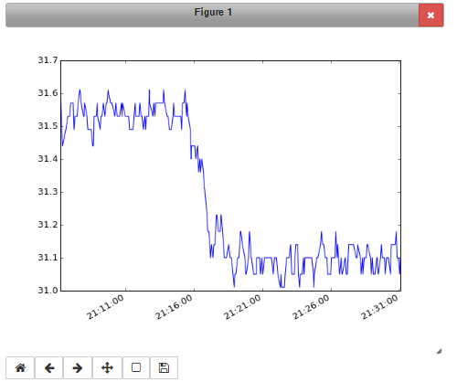

Trends
======
Trending is a nice feature when you want to see how a points value changed over time.
You can plot quick histories in notebooks with Matplotlib_/Seaborn_ and, for live dashboards,
stream point values to InfluxDB and visualize them in the InfluxDB UI or Grafana.

Note: The legacy Bokeh-based web interface has been removed from BAC0. Use InfluxDB for live trending.

Matplotlib
----------
Matplotlib_ is a well known data plotting library for Python. As BAC0's historical point data 
are pandas Series and DataFrames, it's possible to use Matplotlib with BAC0.
i.e. Showing a chart using matplotlib::

    %matplotlib notebook
    # or matplotlib inline for a basic interface
    controller['nvoAI1'].history.plot()

|matplotlib|

Seaborn
-------
Seaborn_ is a library built over Matplotlib_ that extends the possibilities of creating statistical
trends of your data. I strongly suggest you have a look to this library.

Live trends with InfluxDB
-------------------------
BAC0 can periodically write point values to InfluxDB. From there you can create live charts in the
InfluxDB UI (Data Explorer/Dashboards) or in Grafana.

Setup quick start
..................
- Ensure InfluxDB 2.x is running and you have an organization, bucket, and a token.
- Install the Python client in your environment: influxdb-client
- Provide connection details to BAC0 via db_params or environment variables.

Example db_params and network startup::

        params = {
                "name": "InfluxDB",           # required
                "url": "http://192.168.1.10", # server URL (no trailing slash)
                "port": 8086,                   # default InfluxDB port
                "org": "my-org",               # your InfluxDB organization
                "token": "<your-token>",       # API token
                "bucket": "BAC0",              # target bucket
                "write_interval": 60,           # seconds; periodic write task interval
                # Optional WriteOptions tuning (defaults shown):
                # "batch_size": 25,
                # "flush_interval": 10000,
                # "jitter_interval": 2000,
                # "retry_interval": 5000,
                # "max_retries": 5,
                # "max_retry_delay": 30000,
                # "exponential_base": 2,
        }

        bacnet = BAC0.start(db_params=params)

Alternatively, set standard environment variables (loaded via python-dotenv) and pass only name and bucket.
See Database for full details and examples.

What gets written
..................
- Measurement name: Device_{device_id}/{object} (e.g. Device_5004/analogInput:1)
- Tags: object_name, name (device/object), description, units_state, object, device, device_id, plus any point.tags
- Fields: value (numeric) and string_value (human-readable for binary/multistate)
- Timestamps are converted to UTC before writing.

Writing cadence
................
- Each point read appends its latest value to an in-memory batch.
- A background task flushes batched points to InfluxDB every write_interval seconds.
- If InfluxDB becomes temporarily unavailable, the task logs an error and restarts.

View data in InfluxDB UI
..........................
In the InfluxDB web UI:
- Data Explorer: build a query filtering by measurement or tags.

Examples:
- Filter by a specific object instance (measurement)::

    from(bucket: "BAC0")
        |> range(start: -1h)
        |> filter(fn: (r) => r._measurement == "Device_5004/analogInput:1")
        |> filter(fn: (r) => r._field == "value")

- Filter all analog inputs for a device by tag::

    from(bucket: "BAC0")
        |> range(start: -1h)
        |> filter(fn: (r) => r.device_id == "5004")
        |> filter(fn: (r) => r.object =~ /analog/)
        |> filter(fn: (r) => r._field == "value")

Build dashboards from these queries for live charts.

Grafana dashboards (optional)
..............................
- Add an InfluxDB data source (InfluxDB 2.x), configure URL, org, and token.
- Create panels using Flux queries similar to the examples above.

Tips
.....
- Ensure your BAC0 devices are being polled so values update and get batched.
- Use tags (e.g., zone, floor) on points to simplify filtering in dashboards.
- For binary/multistate displays, plot string_value or use value with value mappings.

.. _Jupyter : http://jupyter.org
.. _Matplotlib : http://matplotlib.org
.. _Seaborn : http://seaborn.pydata.org
.. _berryconda : https://github.com/jjhelmus/berryconda
